# Challenge name: Thugs on the boat

## Description:

We’ve received an alarming report about a sensitive data breach within Government Office. The incident seems to have originated from a staff member in the Department of Personnel and Organization who unknowingly downloaded and executed a malicious program. Your task is to step into the shoes of a forensic investigator, analyze the attacker’s behavior and uncover which confidential documents were exfiltrated.

Author: `bquanman`

## Flag: `ASCIS{C@nt_k3Ep_m3_1n_7hE_9r0uNd_Th3_9r0unD_0b3y5_m3_0e2845b20c93546}`

## Download File

[capture.zip](./dist/capture.zip)


## Solution

1. Dump OneDrive PE file từ process memory

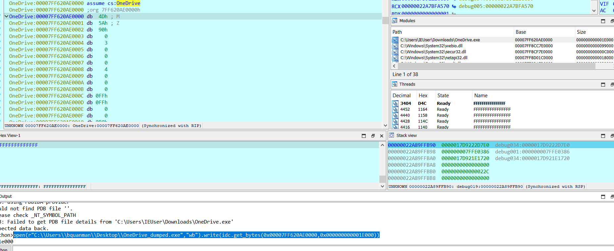

2. Xác nhận file PE là Havoc demon

Chạy strings trên file cho chuỗi demon.x64.exe, bằng cách google có thể thấy đây là demon được tạo từ Havoc framework. Ngoài ra Windows Security và Virustotal cũng có nhận diện tương tự.

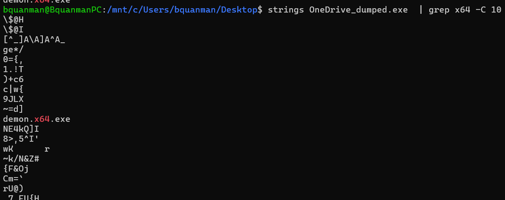

3. Phân tích mã nguồn của Havoc Framework

Traffic trao đổi giữa client và server được mã hóa bằng AES-CTR

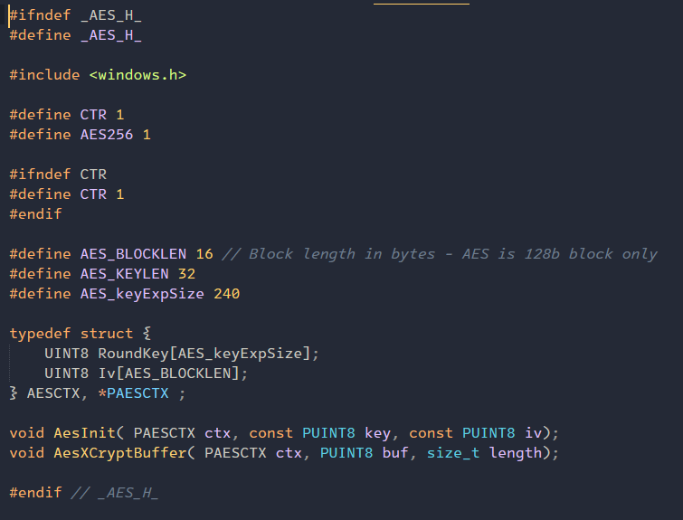

Packet đầu tiên gửi tới server có cấu trúc như sau:

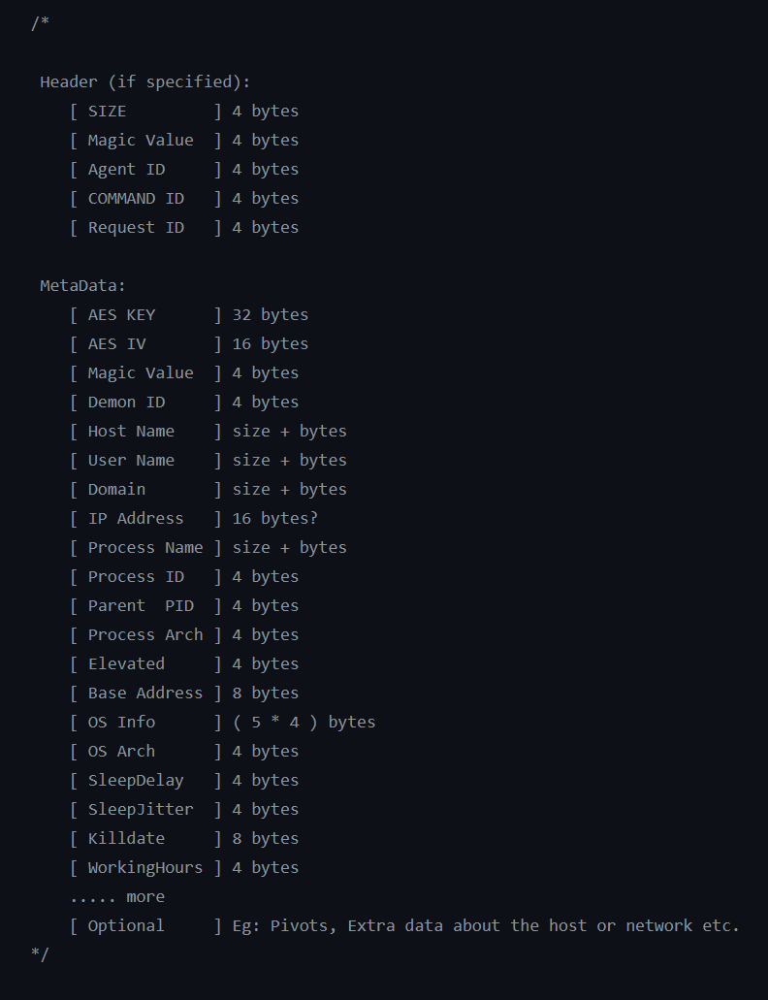

Trong đó: 

* 2 byte đầu tiên của SIZE thường là: 00 00

* Magic Value là DEADBEEF


* Command ID của gói đầu tiên là 99 -> 0x63

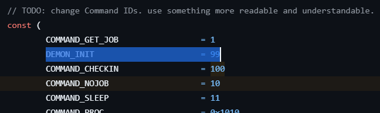

* Request ID = 0  

Mặc dù không bắt được packet đầu tiên trong pcap nhưng có thể nó vẫn còn được lưu trong bộ nhớ => Sử dụng yara rule để tìm packet init này và lấy key và iv


4. Khôi phục Key và IV tự bộ nhớ tiến trình

Tham khảo yara rule của Immersive Labs

```
rule HavocC2Init
{

    meta:
        description = "Detects Havoc C2 Demon Init requests in memory"
        reference = "https://immersivelabs.com"
        author = "@kevthehermit"
        date = "2024-02-07"
        
    strings:
        $DEMON_INIT = { 00 00 ?? ?? de ad be ef ?? ?? ?? ?? 00 00 00 63 00 00 00 00 }

    condition:
        $DEMON_INIT
}
```

Kết quả như sau:

```
$ yara -s havoc-c2-memory.yar capture.DMP
HavocC2Init capture.DMP
0x172f84:$DEMON_INIT: 00 00 01 09 DE AD BE EF 2A C0 84 1E 00 00 00 63 00 00 00 00
```

=> Agent ID: 2AC0841E

Dựa vào địa chỉ của chuỗi trên, ta có thể in ra key và iv

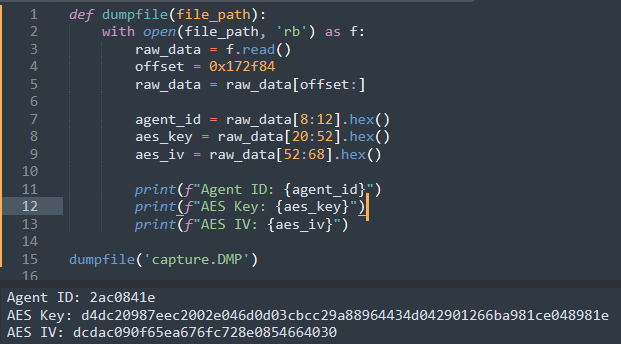

Hoặc tìm thủ công với hexeditor, phần màu đỏ là key và màu vàng là iv

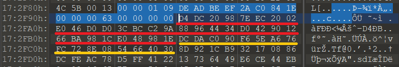

5. Giải mã lưu lượng mạng

Từ đây ta sử dụng script **havoc-pcap-parser.py** để decrypt traffic

```
$ python3 havoc-pcap-parser.py --pcap ../../capture.pcapng --aes-key d4dc20987eec2002e046d0d03cbcc29a88964434d042901266ba981ce048981e --aes-iv dcdac090f65ea676fc728e0854664030 --agent-id 2ac0841e --save ./decrypted
[+] Added session keys for Agent ID 2ac0841e
[+] Parsing Packets
[+] Parsing Request
  [+] Job Request from Server to Agent
    [-] C2 Address: http://192.168.240.148:443/
    [-] Comamnd: COMMAND_NOJOB
[+] Parsing Request
  [+] Job Request from Server to Agent
    [-] C2 Address: http://192.168.240.148:443/
    [-] Comamnd: COMMAND_MEM_FILE
[+] Parsing Request
  [+] Job Request from Server to Agent
    [-] C2 Address: http://192.168.240.148:443/
    [-] Comamnd: COMMAND_NOJOB
[+] Parsing Request
  [+] Job Request from Server to Agent
    [-] C2 Address: http://192.168.240.148:443/
    [-] Comamnd: COMMAND_NOJOB
[+] Parsing Request
  [+] Job Request from Server to Agent
    [-] C2 Address: http://192.168.240.148:443/
    [-] Comamnd: COMMAND_NOJOB
[+] Parsing Request
  [+] Job Request from Server to Agent
    [-] C2 Address: http://192.168.240.148:443/
    [-] Comamnd: COMMAND_NOJOB
[+] Parsing Request
  [+] Job Request from Server to Agent
    [-] C2 Address: http://192.168.240.148:443/
    [-] Comamnd: COMMAND_NOJOB
[+] Parsing Request
  [+] Job Request from Server to Agent
    [-] C2 Address: http://192.168.240.148:443/
    [-] Comamnd: COMMAND_NOJOB
[+] Parsing Request
  [+] Job Request from Server to Agent
    [-] C2 Address: http://192.168.240.148:443/
    [-] Comamnd: COMMAND_NOJOB
.................
```

Trong thư mục đầu ra, ta có các tệp tương ứng với thứ tự của các request, respond

Tệp đầu tiên có header của một file coff với các hàm Whoami

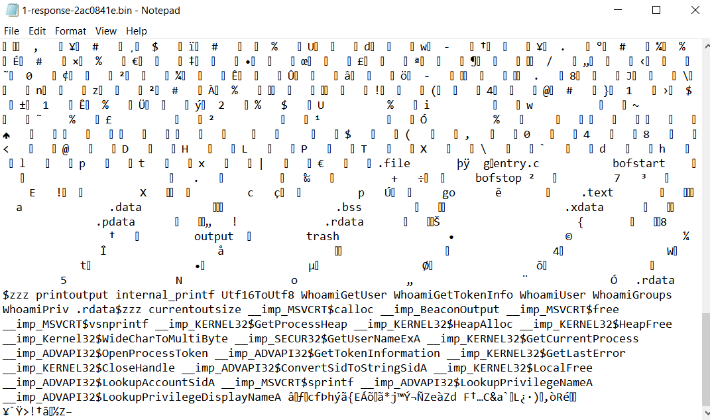

Điều này cho thấy có thể Havoc server đã gửi một tệp BOF(beacon object files) để thực hiện lệnh `whoami` mà không cần khởi chạy cmd.exe

Tiếp theo trong tệp thứ 2 là kết quả máy client gửi tới server với nội dung là output của tệp bof bên trên, tương đương với lệnh `whoami /all` 

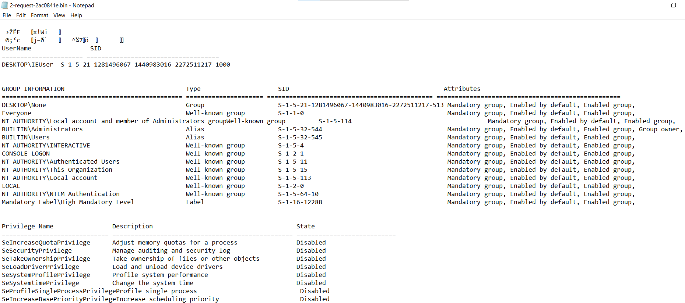

6. Giải mã phần đầu của flag

Ở lệnh tiếp theo, attacker gửi lệnh adduser tới máy nạn nhân, tiếp tục sử dụng beacon object file

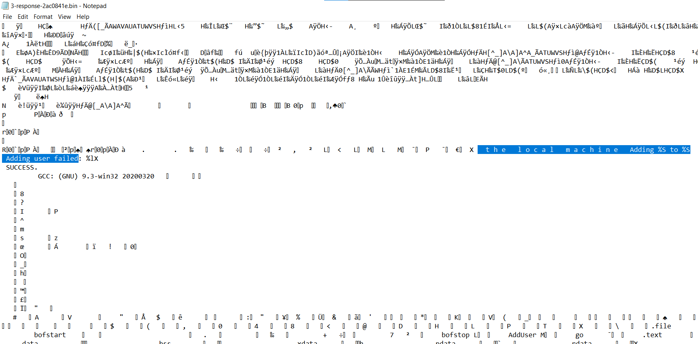

Ở phản hồi tiếp theo từ máy nạn nhân cho thấy user mới đã được add thành công 

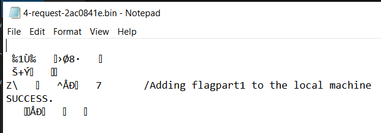

Attacker sau đó chạy lệnh để chắc chắn rằng user mới đã được add thành công, và request gửi từ máy nạn nhân một lần nữa chứng tỏ một user đã được add thành công là `flagpart1`

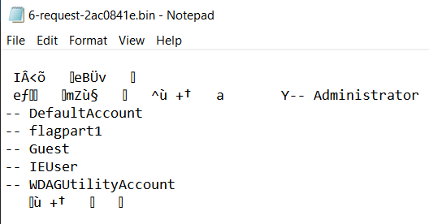

Khi sử dụng lệnh adduser của Havoc, có 2 đối số cần cung cấp là tên user và password, với việc chúng ta biết tên user là flagpart1 rồi thì mật khẩu của user có thể giứa nội dung của flag. Nhưng để biết các đối số này nằm ở đâu trong respond thì ta phải quay lại phân tích packet thứ 3 là respond gửi từ server với tệp bof để chạy lệnh adduser

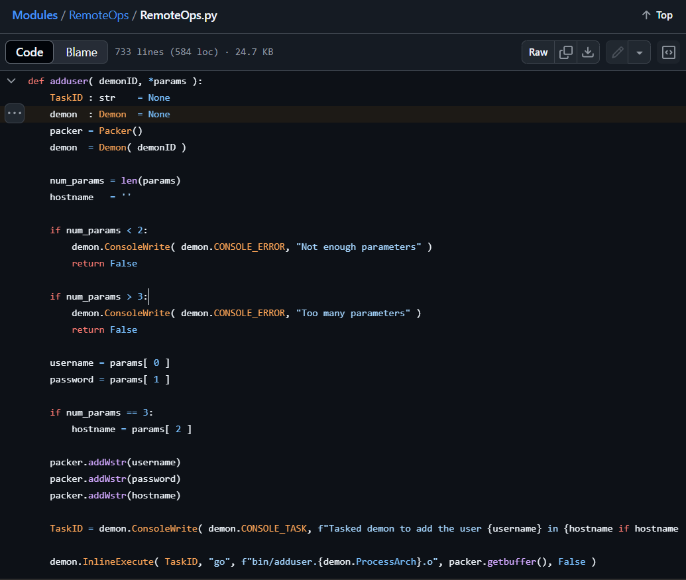

Phân tích code [Modules](https://github.com/HavocFramework/Modules) cho thấy khi lệnh adduser được sử dụng thì tệp `bin/adduser.{demon.ProcessArch}.o` sẽ được sử dụng, các thông số chứa username và password được encode UTF-16 sau đó thêm vào sau tệp bof.

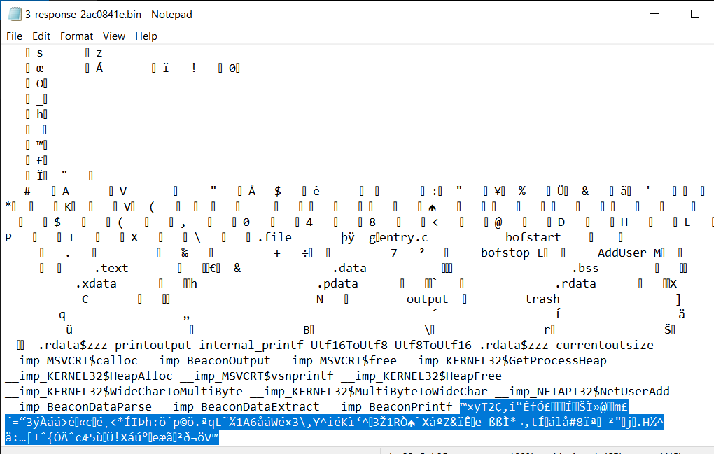

Vì vậy phần cuối cùng của tệp output 3 này có thể là username và password tuy nhiên nó đang được giải mã sai. Để giải mã phần này, ta cần loại bỏ các byte của tệp bof trước

Tải tệp [adduser.x64.o](https://github.com/HavocFramework/Modules/blob/7a513a7da680c161abe46b65ffdcd2e3dc356246/RemoteOps/bin/adduser.x64.o) ta thấy tệp có dung lượng 3583 byte, cộng thêm 16 byte thừa được thêm vào đầu tệp `adduser.x64.o` sau khi giải mã là 3599 bytes. Tiếp tục loại bỏ 24 byte thừa chứa thông tin về TaskID, Command,Executable, packed data length cho tới khi giải mã thành công, cuối cùng decode UTF-16

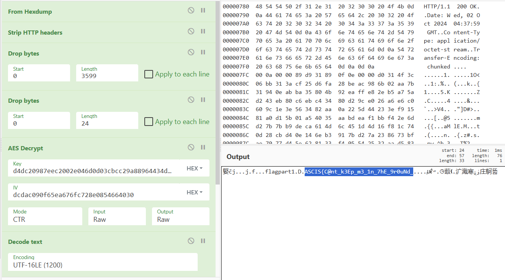

Các param được giải mã thành công là username: `flagpart1`, password: `ASCIS{C@nt_k3Ep_m3_1n_7hE_9r0uNd_` đây cũng là phần đầu tiên của flag

7. Giải mã phần 2 của flag

Sau khi adduser thành công, server gửi tới client một lệnh có id là `09 ce`

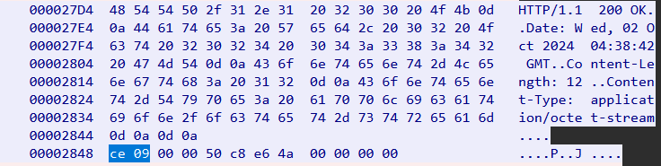

Lệnh này có giá trị là 2510 tương đương với `COMMAND_SCREENSHOT`


Vì vậy nội dung của request tiếp theo chứa hình ảnh màn hình máy nạn nhân

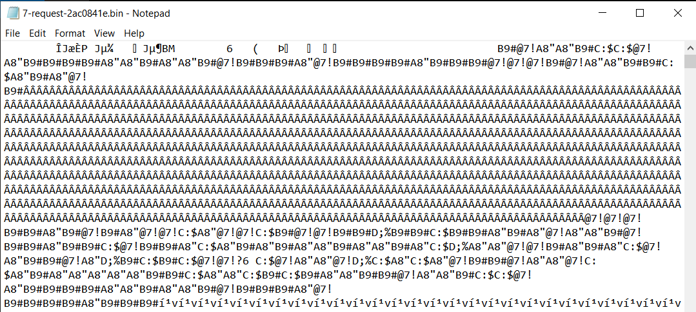

Loại bỏ 20 byte thừa ta được file ảnh bmp

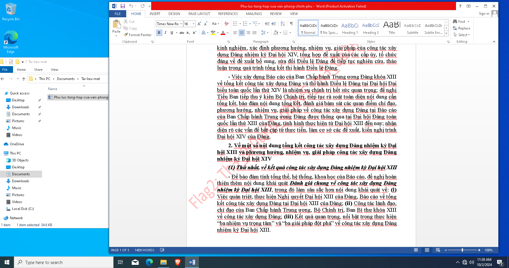

Dựa vào ảnh screenshot, attacker có thể đã thấy tệp tài liệu mật ở trên máy nạn nhân. Vì vậy một loạt các command tiếp theo cho thấy attacker đã di chuyển tới thư mục chứa tệp tài liệu mật và dùng command download để tải về

Tệp 23-request chứa nội dung file `C:\Users\IEUser\Documents\Tai-lieu-mat\Phu-luc-tong-hop-cua-van-phong-chinh-phu.docx` gửi tới attacker

Loại bỏ 232 byte thừa ở đầu tệp, ta được tệp Phu-luc-tong-hop-cua-van-phong-chinh-phu.docx hoàn chỉnh chứa phần thứ 2 của flag nằm ở watermark

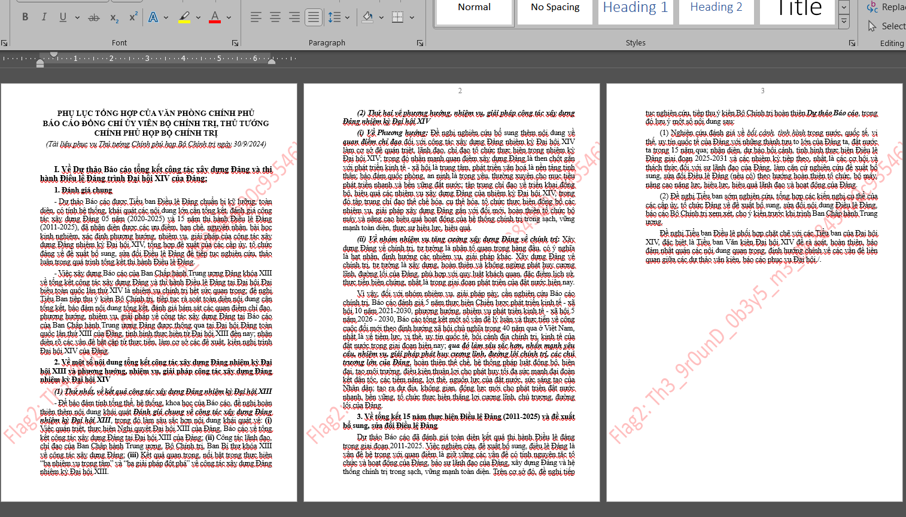


